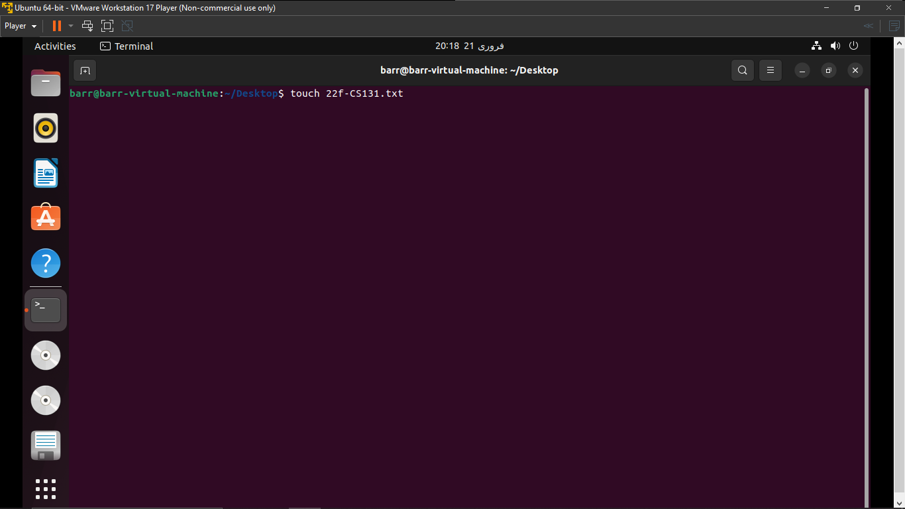
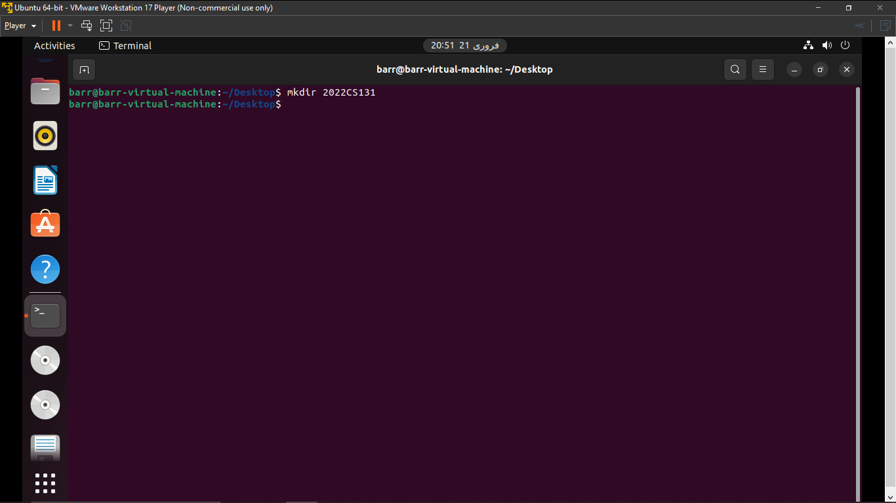

#                                      								**OS Lab 2 (Assignment)**

​          							     	   									**Submitted by:** 

​									            				Muhammad Abdul Barr        2022-CS-131

​												                  				    **Submitted to:**

​				                                                                    Sir Numan Shaffi

​				           											**Department of Computer Science**

​						               						**University of Engineering and Technology**

​										                  							**Lahore Pakistan**

# **Task 1:**

First Open the terminal by Right clicking on Desktop and Select "Open in Terminal."

1. **Create a file named “19f-XXXX.txt”. File must contain at least 10 lines.**

   To create a file we use the Command "touch", followed by file name along with its extention.

   ~~~bash
   touch filename.extention
   ~~~

   

   To Add Text into File we use the command "echo", along with its option(mode) followed by insertion operator ">>" and then the file name.

   ~~~bash
   echo [options] [text] >> [filename.extention]
   ~~~

   

   

2. **Create another file named “your name.txt”. File must contain at least 10 lines.**

   You can use the echo command to create and write text into file using a single command. If file not found the the directory it will create new file and add text automatically.

   

   

3. **Merge the data of both files.**

   You can merge text of files using "cat" command which open file in read mode. 

   ~~~bash
   cat file1name.extention file2name.extention
   ~~~

   

   

4. **Redirect the output to a new file.**

   You can merge text of files using "cat" command which open file in read mode. Then, use the insertion operator to place the output text into new file.

   ~~~bash
   cat file1name.extention file2name.extention >> destinationfile.extention 
   ~~~

   

   

5. **Display the first two lines of first file.**

   We can use "head" command followed by number of lines to show top lines in a file.

   ~~~bash
   head -numberoflines filename.extention 
   ~~~

   

6.  **Display the last two lines of second file**

   Similarly, We can use "tail" command followed by number of lines to show bottom lines in a file.

   ~~~bash
   tail -numberoflines filename.extention 
   ~~~

   

7. **Finds the string (your roll#) from the first file.**

   First we append a phrase in our file using echo command.

   

   

   We Can Find string phrase in a file using "grep" command. This command extracts the phrase from the file and displays it. Red colour shows matched phrases.

   

8.  **Grant the execute permission of the second file to the group.**  

   We can view the current permission using "ls -l" command. This command list the metadata of file. -l shows the long listed metadata.

   ~~~bash
   ls -l /path/to/directory
   ~~~

   

   First three after - shows permission for owner, next three shows permissions for groups and the next three shows permissions for other users.

   - r stands for read permission 

   - w stands for write permission

   - x stands for execute permission 

   - \- stands for no permission 

   We can use "chmod" command to change modification permission for each type. + sign is used to allow permission

   ~~~bash
   chmod [options] mode filename.extention
   ~~~

   Modes are:

   - `u`: User/owner

   - `g`: Group

   - `o`: Others

   - `a`: All (equivalent to \'ugo\')

     \+ sign is then followed to grant permission with combinations of r,w,x.

   

   

9. **Remove the write permission for the owner.** 

   Similarly, We can use - sign to revoke the permission.

   

   

10. **Now Mr. Tom suddenly lost the track of his current location. Help him find his location.** 

    "PWD" command is used to show current working directory.

    ~~~bash
    pwd
    ~~~

    

11. **He wants the list of all files present on Desktop directory.** 

    "ls" command is used to print all the files and folders in the current working directory.

    ~~~bash
    ls
    ~~~

    

12. **Now he wanted to create a folder of his personal files and pictures named as your roll#.** 

    Use "mkdir" command to create a new folder in current working directory.

    ~~~bash
    mkdir [foldername]
    ~~~

    

    

13. **Display the current time.**

    To display current time and date we use "date" command.

    

14. **He is done with the task and he is happy with your work. He want to display a thankyou message.**

    We Use "echo" command to print any string on screen.

    ~~~bash
    echo [text]
    ~~~

    

# **Task 2:**

1. **Create a file named “19f-XXXX_OS-lab_rules.txt” using linux commands. The file must contain all lab rules covered in first lab.**

   We can create a file using "touch" command and add text to file using echo command and insertion operator.

   

   

   

2. **You want to set the rights of created file to this (- rwx r-x r--). For these rights, you are required to convert the given rights in numeric format using binary number system procedure covered in lecture. Show complete working.** 

   

   We can view the current permission using "ls -l" command. This command list the metadata of file. -l shows the long listed metadata.

   ~~~bash
   ls -l /path/to/directory
   ~~~

   

   First three after - shows permission for owner, next three shows permissions for groups and the next three shows permissions for other users.

   - r stands for read permission 

   - w stands for write permission

   - x stands for execute permission 

   - \- stands for no permission 

   We can use "chmod" command to change modification permission for each type. + sign is used to allow permission

   ~~~bash
   chmod XXX filename.extention
   ~~~

   First X shows permission for Owner/user, Second X shows permission for Groups, and Third X shows permission for other users.

   - `rwx`: `111`
   - `rw-`: `110`
   - `r-x`: `101`
   - `r--`: `100`
   - `-wx`: `011`
   - `-w-`: `010`
   - `--x`: `001`
   - `---`: `000`

   So, conversion of Binary to  octal notation:

   - `rwx`: `4 + 2 + 1 = 7`
   - `rw-`: `4 + 2 + 0 = 6`
   - `r-x`: `4 + 0 + 1 = 5`
   - `r--`: `4 + 0 + 0 = 4`
   - `-wx`: `0 + 2 + 1 = 3`
   - `-w-`: `0 + 2 + 0 = 2`
   - `--x`: `0 + 0 + 1 = 1`
   - `---`: `0 + 0 + 0 = 0`

   

    

3. **Now use the derived number to change the permission of a file using chmod command.** 

   

4. **Append the output of ls command to created file.**

   

   

#**GitHub Link:**
https://github.com/Muhammad-Abdul-Barr/OS-Lab/tree/main/Lab%202
